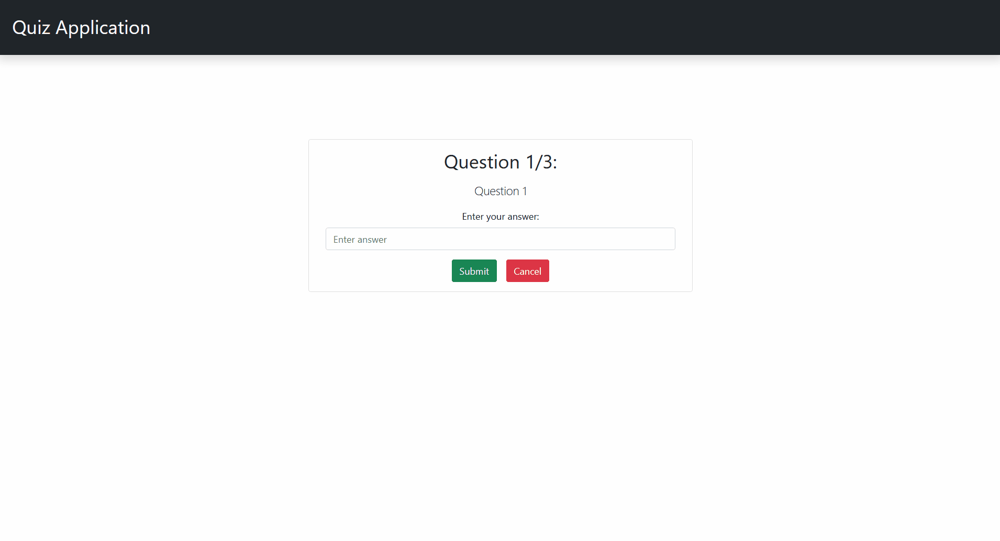

# Spring Boot Quiz App

Quiz application that supports CRUD operations for questions with answers and testing using the questions.

## Demo
### Adding, updating and deleting questions

### Quiz

## Built With
  - React.js
  - Bootstrap 5
  - MySQL
  - Maven
  - Spring Boot
  - Spring Web
  - Spring Data JPA (with Hibernate and MySQL)

## Getting Started

This shows how to get a local copy of the project running for development.

### Installation

For the frontend, install packages
  
    npm install

Use an IDE to import the backend as a Maven project.

### Database Configuration

Create a MySQL database with the name `springquizappdb` and add the database credentials into `/resources/application.properties`.

## Usage

1. Run the backend with your IDE
2. Run the frontend with the command
    
        npm start

3. Go to http://localhost:3000